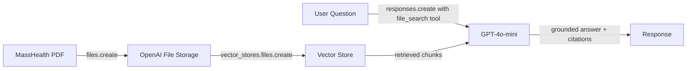

# healthcare-ai-learning

Hands-on RAG QA bot on a public payer coverage policy. Built as portfolio work for the Arun Shankar Manoharan mentorship (Senior Manager Gen AI, Cigna AI Center of Enablement, via ACP).

## The bot

Takes a clinical question, returns a grounded answer with citations back to the source document. The source is MassHealth's [Guidelines for Medical Necessity Determination for Knee Arthroplasty](https://www.mass.gov/doc/guidelines-for-medical-necessity-determination-for-knee-arthroplasty/download) — six pages of structured clinical criteria covering total knee arthroplasty (TKA), unicompartmental/partial knee arthroplasty (UKA/PKA), and revision arthroplasty.

Why this document specifically:

- **It's a prior authorization document.** Same shape as the UHC prior-auth thought challenge proposed during the 6/4 mentorship call. Build the RAG pattern on a comparable artifact.
- **OR-tech validation.** I've scrubbed every one of these procedures as a surgical technologist, so answers can be validated against direct clinical experience without re-reading the document.
- **Public, no PHI.** State Medicaid policy is open record. No HIPAA exposure during the build.
- **Dense retrieval surface.** Multi-criteria rules (a-e for TKA, a-g for UKA, alternative paths for revision), plus an appendix with the Kellgren-Lawrence grading scale. Tests cross-section retrieval.

## Architecture

End-to-end flow:

1. Upload the PDF to OpenAI's file storage with `client.files.create(purpose="assistants")`.
2. Attach the uploaded file to a vector store via `client.vector_stores.files.create`. OpenAI handles chunking, embedding generation, and indexing automatically (status polls from `in_progress` to `completed`).
3. Submit a question through `client.responses.create` with `file_search` wired to the vector store ID. The model invokes the tool, retrieves top-ranked chunks, and generates a grounded answer with file citations attached.

## What `file_search` abstracts away

The cookbook calls this "RAG out of the box," which is accurate but worth unpacking. In a from-scratch custom RAG pipeline, you'd own five distinct concerns:

- **Chunking strategy** — token windows, overlap, hierarchical vs. flat, semantic vs. fixed-size. `file_search` chunks for you (default ~800 tokens with overlap).
- **Embedding generation** — choice of embedding model, dimensionality, batching. `file_search` uses `text-embedding-3-small` under the hood.
- **Vector storage** — the database (FAISS, Pinecone, Chroma, pgvector, etc.), index type, refresh strategy. `file_search` runs its own.
- **Retrieval ranking** — pure semantic search, hybrid (semantic + keyword), reranker model, score thresholds. `file_search` uses hybrid search with automatic query expansion (one user question becomes 2-3 retrieval queries internally — visible in the raw response).
- **Context injection** — selecting top-k chunks, formatting them into the prompt, citation tracking. `file_search` does this and returns annotations linking spans of the answer back to source chunks.

For a single-document demo this trade is correct: ship working code in hours, not weeks. For a healthcare production system processing thousands of payer policies with PHI, each abstraction becomes a control surface you'd want to own — which is why production deployments typically use Pinecone, Azure AI Search, AWS Bedrock Knowledge Bases, or self-hosted stacks with explicit governance.

## Example queries

The five queries below were used to validate the build. Three returned clean grounded answers. Two surfaced classic RAG failure modes — documented in [Known limitations](#known-limitations) rather than hidden, because they matter more for production thinking than a clean demo would.

### Lead example: grounded refusal on out-of-scope question

> **Q:** What is the typical cost or payment amount for knee arthroplasty under MassHealth?
>
> **A:** *"The typical cost or payment amount for knee arthroplasty under MassHealth is not explicitly stated in the documents. However, MassHealth requires prior authorization for knee arthroplasty and evaluates requests based on medical necessity... For specific reimbursement rates or costs, it would be advisable to consult MassHealth regulations or contact their customer service for detailed financial information."*

The PDF says nothing about payment amounts. The bot did not invent a dollar figure. For healthcare RAG, this is the test that matters most: stay grounded when asked about what isn't in the source.

### Multi-criteria retrieval with appendix cross-reference

> **Q:** What are the Kellgren-Lawrence grade requirements for total knee arthroplasty, and what does each grade describe?
>
> The bot correctly identified the requirement (KL stage III or IV) from the main text *and* pulled the full grading scale (Grades 0–IV) from Appendix B. Top retrieval chunks scored 0.72+ — strong cross-section retrieval.

### Clinical nuance: relative vs. absolute contraindication

> **Q:** Can a patient who received an articular injection 2 months ago be approved for total knee arthroplasty?
>
> The bot identified this as a *relative* contraindication (the PDF lists "articular injection within the last 3 months" under Section II.B.3.c). It correctly noted the patient falls inside the 3-month window and would need additional documentation, rather than answering "yes" or "no" categorically.

## Known limitations

These were discovered in testing and are kept here on purpose — they're more useful as production-thinking material than a clean test set would be.

**1. Hallucination-by-augmentation.** Asked what CPT codes are required in a prior authorization request, the bot returned specific codes (27447 for TKA, 27446 for UKA, 27486 for revision) that are real codes for these procedures but are not present in the source PDF. The PDF only requires that "appropriate CPT code(s) for the procedure being requested" be included, without listing them. The bot pulled the specific codes from training data. The danger here is not that the answer is wrong — it isn't — but that a casual reader couldn't distinguish the grounded portion from the model's own additions. Mitigation in production: tighter system prompts requiring explicit "source: training" disclosure, or a post-generation grounding verification step that compares claims against retrieved chunks.

**2. Logical structure collapse.** Asked about revision arthroplasty criteria, the PDF specifies two **alternative** paths — criterion (a) OR all of criterion (b)(1,2,3) — but the bot collapsed them into a single set of all-required criteria. Retrieval pulled the right chunks; generation didn't preserve the document's logical structure. Mitigation: chain-of-thought prompting that requires the model to identify alternative paths explicitly, or document-aware prompting that surfaces the OR/AND structure in the system context.

**3. Invisible query expansion.** `file_search` expands one user question into multiple retrieval queries under the hood (visible in `response.output[i].queries`). For a demo this is fine; for an audited healthcare deployment, every retrieval query becomes evidence in a downstream review and should be logged.

## Production / PHI considerations

The code in this repo is dev-grade. What changes for a real healthcare deployment:

- **BAA-covered infrastructure.** OpenAI's standard API does not include a Business Associate Agreement. Real PHI requires moving to Azure OpenAI (BAA available), AWS Bedrock with the appropriate compliance configuration, or a fully self-hosted stack (open-weights embedding models + a self-hosted vector DB inside the controlled environment).
- **Access controls on the vector store.** Anyone with the API key can query every document in the store. Production needs per-document and per-user authorization, full audit logging on every retrieval, and the ability to remove documents on demand (right-to-forget).
- **Credential hygiene.** This repo's API key lives in Colab Secrets and is never committed. The notebook reads from `userdata.get(...)`. Production: secrets manager (HashiCorp Vault, AWS Secrets Manager, Azure Key Vault), short-lived tokens, automatic key rotation, scoped permissions per service. Same pattern, harder controls.
- **De-identification at the boundary.** For documents that contain PHI before they reach the vector store (clinical notes, prior-auth case files), de-identification is mandatory regardless of whether the storage is BAA-covered. Less data in the pipeline means smaller blast radius.
- **Output verification.** Limitation #1 above is the production case for an answer-vs-source consistency check before the response leaves the system. Cheaper than dealing with a downstream incorrect-information complaint.

## How to run it

1. Click the **Open in Colab** badge at the top of this README.
2. Get an OpenAI API key at [platform.openai.com/api-keys](https://platform.openai.com/api-keys). Add a small credit balance ($5 minimum — typical query costs ~$0.004).
3. In Colab, open **Secrets** (key icon in the left sidebar). Add a new secret named `OPEN_API_KEY` with your key as the value. Toggle **Notebook access** on.
4. Download the [MassHealth PDF](https://www.mass.gov/doc/guidelines-for-medical-necessity-determination-for-knee-arthroplasty/download) and drop it into `/content/` as `knee_arthroplasty_mng.pdf`.
5. Run cells in order.

## Built on

- OpenAI Cookbook: [Doing RAG on PDFs using File Search in the Responses API](https://cookbook.openai.com/examples/file_search_responses)
- OpenAI [Responses API + file_search tool](https://platform.openai.com/docs/guides/tools-file-search)

The notebook adapts the cookbook's multi-PDF pattern for a focused single-document use case with healthcare framing and additional grounding tests.
