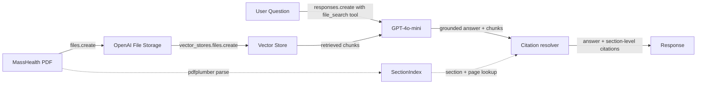

# healthcare-ai-learning

[](https://colab.research.google.com/github/kayseenin/healthcare-ai-learning/blob/main/01_file_search_walkthrough.ipynb)

Hands-on RAG QA bot on a public payer coverage policy. Built as portfolio work.

**v2 update (July 2026):** citations now resolve to the specific section and page of the source policy (e.g. `Section II.A.2.g, p. 3`) instead of just the filename. v1 details are preserved below and in git history; the notebook in the badge is the current v2 build.

## The bot

Takes a clinical question, returns a grounded answer with citations back to the source document — down to the specific outline section and page. The source is MassHealth's [Guidelines for Medical Necessity Determination for Knee Arthroplasty](https://www.mass.gov/doc/guidelines-for-medical-necessity-determination-for-knee-arthroplasty/download) — six pages of structured clinical criteria covering total knee arthroplasty (TKA), unicompartmental/partial knee arthroplasty (UKA/PKA), and revision arthroplasty.

Why this document specifically:

- **It's a prior authorization document.** Same shape as the UHC prior-auth thought challenge proposed during the 6/4 mentorship call. Build the RAG pattern on a comparable artifact.
- **OR-tech validation.** I've scrubbed every one of these procedures as a surgical technologist, so answers can be validated against direct clinical experience without re-reading the document.
- **Public, no PHI.** State Medicaid policy is open record. No HIPAA exposure during the build.
- **Dense retrieval surface.** Multi-criteria rules (a-e for TKA, a-g for UKA, alternative paths for revision), plus an appendix with the Kellgren-Lawrence grading scale. Tests cross-section retrieval.

## Architecture



End-to-end flow:

1. Upload the PDF to OpenAI's file storage with `client.files.create(purpose="assistants")`.
2. Attach the uploaded file to a vector store via `client.vector_stores.files.create`. OpenAI handles chunking, embedding generation, and indexing automatically (status polls from `in_progress` to `completed`).
3. In parallel, run the PDF through `SectionIndex.from_pdf(...)` — an in-notebook parser that walks the document with `pdfplumber` and builds an ordered map of every outline marker (Section, Appendix, A., 1., a., 1)) with page number and character offset.
4. Submit a question through `client.responses.create` with `file_search` wired to the vector store ID. The model invokes the tool, retrieves top-ranked chunks, and generates a grounded answer.
5. For each retrieved chunk, `resolve_quote(chunk_text)` looks up the deepest section marker preceding the chunk's location and returns `(section_label, page)`. The final response pairs the grounded answer with section-level citations.

## v2: Section-level citations

v1 returned `Sources cited: {knee_arthroplasty_mng.pdf}` — accurate but not clinically useful. If a reviewer needs to verify an answer, "somewhere in the PDF" isn't a citation, it's a homework assignment. v2 fixes that.

**Before (v1):**

```
Q: Is robot-assisted total knee arthroplasty (Makoplasty) covered by MassHealth?
A: No. Robot-assisted TKA (Makoplasty) is considered investigational or
   experimental and is not covered.
Sources cited: {'knee_arthroplasty_mng.pdf'}
```

**After (v2):**

```
Q: Is robot-assisted total knee arthroplasty (Makoplasty) covered by MassHealth?
A: No. Robot-assisted TKA (Makoplasty) is considered investigational or
   experimental and is not covered.
Sources:
  • Section II.B.1.c, p. 3   (score=0.87)
  • Section II.B.1,   p. 3   (score=0.71)
```

### How the parser works

OpenAI's `file_search` handles chunking, embedding, retrieval, and inline citations — but it only exposes the source filename, not where in the document the chunk came from. The `SectionIndex` closes that gap:

1. **Extract per-page text** with `pdfplumber`, keeping page boundaries intact so citations can report page numbers.
2. **Scan line-by-line for outline markers** — `Section I.`, `A.`, `1.`, `a.`, `1)`, `Appendix A:`, `Select References` — and stack them into a five-level hierarchy state.
3. **Disambiguate siblings from children by numeric monotonicity.** The MassHealth doc reuses `1.` at multiple depths — a top-level A-B-C item, a sub-item under a lowercase letter, a bibliographic entry. When a new `N.` appears, the parser walks backward through the current path looking for a slot whose value is `N-1`. If found, the marker is a sibling at that slot's depth (truncate and replace). Otherwise it's a child of the deepest existing slot. Same logic applies to lowercase letters.
4. **Resolve chunks by whitespace-flexible prefix match.** For each `file_search` chunk, build a regex from the first several tokens of its text with `\s+` between them so line breaks and hyphenation don't defeat the match. Anchor on the earliest occurrence in the page text, then look up the deepest marker at-or-before that offset.

Because the parser and file_search see the document independently, small extraction differences (unicode punctuation, hyphenation) can cause a match to miss. The notebook prints `[unresolved]` in that case rather than guessing.

### Ground-truth spot-check

Independent of the LLM: given a known passage from the source doc, does the index return the right section + page?

| Passage | Resolved to |
|---|---|
| "BMI < 40" | Section II.A.2.g, p. 3 |
| "Robot-assisted TKA (Makoplasty)" | Section II.B.1.c, p. 3 |
| "Articular injection within the last 3 months" | Section II.B.3.c, p. 3 |
| "The primary diagnosis name(s) and the ICD-CM code(s)" | Section III.A.1, p. 4 |
| "Ice/heat" | Appendix A.2.a, p. 5 |
| "Grade IV: Large osteophytes" | Appendix B, p. 5 |
| "Neuropathic joint" | Section II.B.4.b, p. 4 |
| "Tenderness, swelling, effusion" | Section II.A.1.c.1), p. 2 |
| "Pain that is persistent and severe" | Section II.A.1.b.1, p. 2 |
| "Aseptic loosening, osteolysis" | Section II.A.3.b.3, p. 3 |

10/10 resolve correctly. The full check runs at the end of the notebook so a fresh Colab session can verify it in one cell.

### Why this matters beyond the citation itself

Section-level citations aren't just cosmetic — they're the substrate the next round of work sits on:

- **Evals become possible.** With ground-truth section labels, we can now measure whether the model cites the *correct* section for a given question, not just cites something.
- **Bad retrieval becomes debuggable.** When a chunk's resolved section is topically unrelated to the answer, that's a retrieval failure the evals suite will catch.
- **UI has something to render.** The Gradio v2 UI will show clickable citations that scroll the source PDF to the right section.

## What `file_search` abstracts away

The cookbook calls this "RAG out of the box," which is accurate but worth unpacking. In a from-scratch custom RAG pipeline, you'd own five distinct concerns:

- **Chunking strategy** — token windows, overlap, hierarchical vs. flat, semantic vs. fixed-size. `file_search` chunks for you (default ~800 tokens with overlap).
- **Embedding generation** — choice of embedding model, dimensionality, batching. `file_search` uses `text-embedding-3-small` under the hood.
- **Vector storage** — the database (FAISS, Pinecone, Chroma, pgvector, etc.), index type, refresh strategy. `file_search` runs its own.
- **Retrieval ranking** — pure semantic search, hybrid (semantic + keyword), reranker model, score thresholds. `file_search` uses hybrid search with automatic query expansion (one user question becomes 2-3 retrieval queries internally — visible in the raw response).
- **Context injection** — selecting top-k chunks, formatting them into the prompt, citation tracking. `file_search` does this and returns annotations linking spans of the answer back to source chunks — but only at the file level. v2's `SectionIndex` is what makes those citations locate-able inside the document.

For a single-document demo this trade is correct: ship working code in hours, not weeks. For a healthcare production system processing thousands of payer policies with PHI, each abstraction becomes a control surface you'd want to own — which is why production deployments typically use Pinecone, Azure AI Search, AWS Bedrock Knowledge Bases, or self-hosted stacks with explicit governance.

## Example queries

The five queries below were used to validate the build. Three returned clean grounded answers. Two surfaced classic RAG failure modes — documented in [Known limitations](#known-limitations) rather than hidden, because they matter more for production thinking than a clean demo would.

### Lead example: grounded refusal on out-of-scope question

> **Q:** What is the typical cost or payment amount for knee arthroplasty under MassHealth?
>
> **A:** *"The typical cost or payment amount for knee arthroplasty under MassHealth is not explicitly stated in the documents. However, MassHealth requires prior authorization for knee arthroplasty and evaluates requests based on medical necessity... For specific reimbursement rates or costs, it would be advisable to consult MassHealth regulations or contact their customer service for detailed financial information."*

The PDF says nothing about payment amounts. The bot did not invent a dollar figure. For healthcare RAG, this is the test that matters most: stay grounded when asked about what isn't in the source.

### Multi-criteria retrieval with appendix cross-reference

> **Q:** What are the Kellgren-Lawrence grade requirements for total knee arthroplasty, and what does each grade describe?
>
> The bot correctly identified the requirement (KL stage III or IV) from the main text *and* pulled the full grading scale (Grades 0–IV) from Appendix B. In v2 the citations resolve to `Section II.A.1.d, p. 2` (the KL requirement) and `Appendix B, p. 5` (the grading scale) — the cross-section retrieval is now visible in the source list, not just implied by the answer text.

### Clinical nuance: relative vs. absolute contraindication

> **Q:** Can a patient who received an articular injection 2 months ago be approved for total knee arthroplasty?
>
> The bot identified this as a *relative* contraindication and cited `Section II.B.3.c, p. 3` — the exact rule about articular injections within the last 3 months. It correctly noted the patient falls inside the 3-month window and would need additional documentation, rather than answering "yes" or "no" categorically. v1 could only claim the citation was in the PDF; v2 shows exactly where.

## Known limitations

These were discovered in testing and are kept here on purpose — they're more useful as production-thinking material than a clean test set would be.

**1. Hallucination-by-augmentation.** Asked what CPT codes are required in a prior authorization request, the bot returned specific codes (27447 for TKA, 27446 for UKA, 27486 for revision) that are real codes for these procedures but are not present in the source PDF. The PDF only requires that "appropriate CPT code(s) for the procedure being requested" be included, without listing them. The bot pulled the specific codes from training data. The danger here is not that the answer is wrong — it isn't — but that a casual reader couldn't distinguish the grounded portion from the model's own additions. Mitigation in production: tighter system prompts requiring explicit "source: training" disclosure, or a post-generation grounding verification step that compares claims against retrieved chunks. v2's section-level citations make the second option cheaper — a claim that cites `Section III.A.3` can be checked against the text of that section directly.

**2. Logical structure collapse.** Asked about revision arthroplasty criteria, the PDF specifies two **alternative** paths — criterion (a) OR all of criterion (b)(1,2,3) — but the bot collapsed them into a single set of all-required criteria. Retrieval pulled the right chunks; generation didn't preserve the document's logical structure. Mitigation: chain-of-thought prompting that requires the model to identify alternative paths explicitly, or document-aware prompting that surfaces the OR/AND structure in the system context.

**3. Invisible query expansion.** `file_search` expands one user question into multiple retrieval queries under the hood (visible in `response.output[i].queries`). For a demo this is fine; for an audited healthcare deployment, every retrieval query becomes evidence in a downstream review and should be logged.

**4. The parser is doc-shape-specific.** `SectionIndex` assumes the outline scheme MassHealth uses — Roman numeral sections, uppercase-letter subsections, arabic-number items, lowercase-letter sub-items, `1)` at the deepest level. Onboarding a new payer's policy means either matching this scheme or extending the parser. A production version would infer the outline scheme automatically or fall back to page-only citations when the scheme isn't recognized. Related: if OpenAI's PDF extractor and `pdfplumber` disagree on hyphenation or unicode punctuation, whitespace-flexible matching can still miss — the notebook prints `[unresolved]` rather than guessing.

## Production / PHI considerations

The code in this repo is dev-grade. What changes for a real healthcare deployment:

- **BAA-covered infrastructure.** OpenAI's standard API does not include a Business Associate Agreement. Real PHI requires moving to Azure OpenAI (BAA available), AWS Bedrock with the appropriate compliance configuration, or a fully self-hosted stack (open-weights embedding models + a self-hosted vector DB inside the controlled environment).
- **Access controls on the vector store.** Anyone with the API key can query every document in the store. Production needs per-document and per-user authorization, full audit logging on every retrieval, and the ability to remove documents on demand (right-to-forget).
- **Credential hygiene.** This repo's API key lives in Colab Secrets and is never committed. The notebook reads from `userdata.get(...)`. Production: secrets manager (HashiCorp Vault, AWS Secrets Manager, Azure Key Vault), short-lived tokens, automatic key rotation, scoped permissions per service. Same pattern, harder controls.
- **De-identification at the boundary.** For documents that contain PHI before they reach the vector store (clinical notes, prior-auth case files), de-identification is mandatory regardless of whether the storage is BAA-covered. Less data in the pipeline means smaller blast radius.
- **Output verification.** Limitation #1 above is the production case for an answer-vs-source consistency check before the response leaves the system. Section-level citations lower the cost of that check. Cheaper than dealing with a downstream incorrect-information complaint.

## How to run it

1. Click the **Open in Colab** badge at the top of this README.
2. Get an OpenAI API key at [platform.openai.com/api-keys](https://platform.openai.com/api-keys). Add a small credit balance ($5 minimum — typical query costs ~$0.004).
3. In Colab, open **Secrets** (key icon in the left sidebar). Add a new secret named `OPEN_API_KEY` with your key as the value. Toggle **Notebook access** on.
4. Download the [MassHealth PDF](https://www.mass.gov/doc/guidelines-for-medical-necessity-determination-for-knee-arthroplasty/download) and drop it into `/content/` as `knee_arthroplasty_mng.pdf`.
5. Run cells in order. The notebook installs `pdfplumber` alongside `openai` in the first cell.

## Built on

- OpenAI Cookbook: [Doing RAG on PDFs using File Search in the Responses API](https://cookbook.openai.com/examples/file_search_responses)
- OpenAI [Responses API + file_search tool](https://platform.openai.com/docs/guides/tools-file-search)
- [`pdfplumber`](https://github.com/jsvine/pdfplumber) for per-page text extraction feeding the section index

The notebook adapts the cookbook's multi-PDF pattern for a focused single-document use case with healthcare framing, additional grounding tests, and a structural citation layer.
